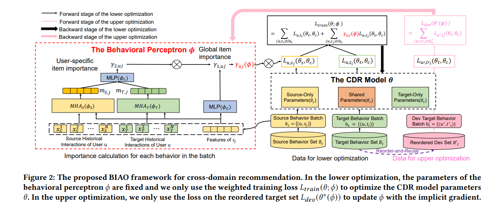

# Cross-domain Recommendation with Behavioral Importance Perceptron
by Hong Chen, Xin Wang, Ruobing Xie, Yuwei Zhou, and Wenwu Zhu.

## Introduction
This repository is for our work **Cross-domain Recommendation with Behavioral Importance Perceptron**. Our work aims to learn a weight for each behavior loss in the source domain, so that the beneficial information in the source domain can be selected to transfer to the target domain, while the harmful information can be discarded. You can download our [paper]() here. Some codes of the bi-level optimization tools are modified from our previous ICML work [Auxiliary Learning with Joint Task and Data Scheduling](https://github.com/forchchch/JTDS), if you are interested in the usage of the bi-level optimization part, you can refer to this repo. The provided code can be used to reproduce the Books-Toys cross-domain recommendation with the CoNet as the backbone. Other experiments in the paper can be easily implemented by conveniently changing the backbone or dataset.


## Prepara Data
You can download the dataset from Amazon Product by running the following script:
```
sh download_data.sh
```
Create a folder named **data** and **preprocess_data/**, and then put these downloaded and unzipped files in the **data/** folder. After download the dataset, running the following dataset preprocessing scripts, and you will obtain the preprocessed data including the splitted train, valid and test set in the **preprocess_data/** folder.
```
python data_split.py
python feature_process.py
python feature_process2.py
```
## Run the experiment
### Environment 
```
Python = 3.8.0
Torch = 1.10.2
NVIDIA GeForce RTX 3090/24G
```

### Training and Evaluation
Running the following script with your defined experiment name, and the folder "conet_record/book_toy/" will be created. You can find the checkpoint and the training log with your experiment name in the folder.  
```
sh conet_train.sh
```
Additionally, if you want to run some of the baselines or tune hyperparameters, change the conet_params.json in the config folder. 
### Explanation for key configs
    + use_meta: 1 for using our proposed method, 0 for running the original CoNet baseline.
    + interval/descent_step: the interval hyper-parameter in the paper
    + aux_decay: the weight decay of the perceptron to avoid the perceptron overfitting, searched from {0.0, 1e-3, 1e-2, 1e-1, 1.0, 2.0} to adapt to different datasets and backbones.
    + only_target: 1 for the CoNet-S baseline, 0 for other methods.

## Lower and Upper Optimization
    + lower update: In line 310 - line 341 in train.py.
    + upper update: In line 343 - line 406 in train.py. Note we use an additional target head(replace_pred in the conet_model) to calculate the upper gradient instead of the original target head, to prevent the upper optimization only focusing on the target domain as indicated in the paper "SHOULD WE BE Pre-TRAINING? EXPLORING END-TASK AWARE TRAINING IN LIEU OFCONTINUED PRE-TRAINING". Therefore, we will conduct the meta optimization in line 343 to optimize this additional target head. 
    + perceptron: Implemented in the auxilearn/hypernet.py

We observe subtle performance variances with different hardware devices even when we fix all the ramdom variables. Additionally, the learned weights will be different if you choose different backbones. For example, MiNet and CoNet will
have different learned sample weights. Also, the bi-level optimization will suffer overfitting, so the early-stop strategy should be adopted.

Please kindly cite our paper if you find it useful, where the bib will be updated after the conference.

## Citation
```bib
@inproceedings{chen2023cross,
  title={Cross-domain Recommendation with Behavioral Importance Perceptron},
  author={Chen, Hong and Wang, Xin and Xie, Ruobing and Zhou, Yuwei and Zhu, Wenwu},
  booktitle={Proceedings of the ACM Web Conference 2023},
  year={2023}
}
```
